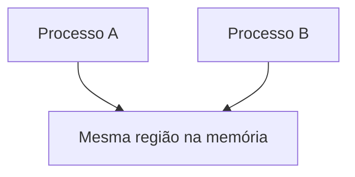

# Memória compartilhada

A **memória compartilhada** (*shared memory*) é um mecanismo de IPC em que dois ou mais processos acessam a **mesma região de memória**.

A ideia é:



Aqui, os processos não enviam dados por meio de `read()` ou `write()`. Eles acessam diretamente uma área de memória compartilhada.

## O problema que a memória compartilhada resolve

Normalmente, processos são isolados. Se temos `int x = 10` no **Processo A**, o **Processo B** não consegue acessar esse `x`.

Isso oferece segurança e isolamento, mas, às vezes, queremos que dois processos compartilhem dados rapidamente. Exemplos:

- Um processo produz dados, e outro os consome.
- Um processo escreve o estado atual, e outro lê esse estado.
- Vários processos acessam uma tabela comum.

Com *pipes*, *sockets* ou filas de mensagens, os dados passam pelo kernel na forma de bytes ou mensagens. Com a memória compartilhada, os processos acessam diretamente a mesma região.

### Por que a memória compartilhada é rápida?

Porque evita cópias frequentes de dados entre processos. Isso é muito eficiente para grandes volumes de dados.

## O grande problema: sincronização

A memória compartilhada é rápida, mas exige cuidado. Imagine:

```text
Processo A está escrevendo uma struct.
Processo B lê durante a escrita.
```

O processo B pode ver dados incompletos. Portanto, a regra é: **a memória compartilhada quase sempre precisa de sincronização**. Normalmente, usamos:

- Semáforos.
- *Mutexes* compartilhados.
- *Futexes*.
- Variáveis de condição compartilhadas.
- *Spinlocks*.

## Formas comuns de memória compartilhada em C e Linux

As principais formas são:

1. Memória compartilhada POSIX:
    - `shm_open()`.
    - `ftruncate()`.
    - `mmap()`.
2. `mmap()` anônimo com `MAP_SHARED`:
    - Útil entre pai e filho após `fork()`.
3. Memória compartilhada System V:
    - `shmget()`.
    - `shmat()`.
    - `shmdt()`.
    - `shmctl()`.

A forma mais simples é a **memória compartilhada POSIX**.

## Fluxo da memória compartilhada POSIX

O processo que cria a memória faz:

```c
shm_open()
ftruncate()
mmap()
// Usar a memória
munmap()
close()
shm_unlink()
```

Outro processo faz:

```c
shm_open()
mmap()
// Usar a memória
munmap()
close()
```

A finalidade de cada chamada é:

- `shm_open()`: cria ou abre um objeto de memória compartilhada.
- `ftruncate()`: define o tamanho do objeto.
- `mmap()`: mapeia o objeto no espaço de memória do processo.

O ponto mais importante é `mmap()`. Ele faz uma região aparecer dentro da memória virtual do processo.

## Primeiro exemplo: escritor e leitor

Vamos criar dois programas:

1. `writer.c`: cria a memória compartilhada e escreve uma mensagem.
2. `reader.c`: abre a memória compartilhada e lê a mensagem.

Nome da memória compartilhada: `/minha_memoria`.

Em POSIX, o nome geralmente começa com `/`.

### `writer.c`

```c
#include <stdio.h>
#include <string.h>
#include <fcntl.h>
#include <unistd.h>
#include <sys/mman.h>
#include <sys/stat.h>

#define SHM_NAME "/minha_memoria"
#define SHM_SIZE 4096

int main(void) {
    int fd = shm_open(SHM_NAME, O_CREAT | O_RDWR, 0666);

    if (fd == -1) {
        perror("shm_open");
        return 1;
    }

    if (ftruncate(fd, SHM_SIZE) == -1) {
        perror("ftruncate");
        close(fd);
        return 1;
    }

    void *ptr = mmap(NULL, SHM_SIZE, PROT_READ | PROT_WRITE, MAP_SHARED, fd, 0);
   
    if (ptr == MAP_FAILED) {
        perror("mmap");
        close(fd);
        return 1;
    }  

    const char *msg = "Olá pela memória compartilhada!";

    strcpy((char *) ptr, msg);

    printf("Writer escreveu: %s\n", msg);

    munmap(ptr, SHM_SIZE);
    
    close(fd);
    return 0;
}
```

### `reader.c`

```c
#include <stdio.h>
#include <fcntl.h>
#include <unistd.h>
#include <sys/mman.h>
#include <sys/stat.h>

#define SHM_NAME "/minha_memoria"
#define SHM_SIZE 4096

int main(void) {
    int fd = shm_open(SHM_NAME, O_RDONLY);

    if (fd == -1) {
        perror("shm_open");
        return 1;
    }

    void *ptr = mmap(NULL, SHM_SIZE, PROT_READ, MAP_SHARED, fd, 0);

    if (ptr == MAP_FAILED) {
        perror("mmap");
        close(fd);
        return 1;
    }

    printf("Reader leu: %s\n", (char *)ptr);

    munmap(ptr, SHM_SIZE); // Desfaz o mapeamento.
    close(fd);

    // Remove o objeto de shared memory do sistema.
    // Faça isso quando não precisar mais dele.
    shm_unlink(SHM_NAME);
    return 0;
}
```

## `shm_open()` retorna um descritor de arquivo

```c
int fd = shm_open(...)
```

Essa função retorna um descritor de arquivo, de forma semelhante a `open()`. Entretanto, esse `fd` representa um **objeto de memória compartilhada**, e não um arquivo comum. Depois, usamos o descritor em `mmap()`.

```mermaid
    flowchart LR
    A[shm_open()]
    B[fd do objeto de shared memory]
    C[mmap()]
    D[ponteiro para a memória compartilhada]
    A --> B
    B --> C
    C --> D
```

## `ftruncate()` define o tamanho

Quando criamos um objeto com `shm_open()`, ele pode ter tamanho zero. Portanto, precisamos definir seu tamanho:

```c
ftruncate(fd, SHM_SIZE);
```

Sem isso, o `mmap()` pode falhar ou podemos acessar memória inválida.

- `shm_open()`: cria o objeto.
- `ftruncate()`: define o tamanho.
- `mmap()`: coloca o objeto na memória do processo.

## `mmap()` é o centro da ideia

A chamada:

```c
void *ptr = mmap(NULL, SHM_SIZE, PROT_READ | PROT_WRITE, MAP_SHARED, fd, 0);
```

Significa:

- `NULL`: o kernel escolhe o endereço virtual.
- `SHM_SIZE`: indica o tamanho da região.
- `PROT_READ | PROT_WRITE`: permite leitura e escrita.
- `MAP_SHARED`: torna as alterações visíveis para outros processos.
- `fd`: indica o objeto que será mapeado.
- `0`: indica o deslocamento (*offset*) inicial.

O retorno é um ponteiro `void *ptr`. Depois disso, usamos como memória comum:

```c
char *mem = ptr;
mem[0] = 'A';
strcpy(mem, "texto");
```

## `MAP_SHARED` vs `MAP_PRIVATE`

- `MAP_SHARED`: alterações são visíveis para outros processos.
- `MAP_PRIVATE`: alterações são privadas do processo (*copy-on-write*).

Se usar `MAP_PRIVATE`, cada processo pode ver sua própria cópia modificada.

## Memória compartilhada com *structs*

Vamos compartilhar uma struct:

```c
typedef struct {
    int id;
    double valor;
    char status[64];
} Dados;
```

Arquivo `writer_struct.c`:

```c
#include <stdio.h>
#include <string.h>
#include <fcntl.h>
#include <unistd.h>
#include <sys/mman.h>
#include <sys/stat.h>

#define SHM_NAME "/dados_compartilhados"

typedef struct {
    int id;
    double valor;
    char status[64];
} Dados;

int main(void) {
    int fd = shm_open(SHM_NAME, O_CREAT | O_RDWR, 0666);

    if (fd == -1) {
        perror("shm_open");
        return 1;
    }

    if (ftruncate(fd, sizeof(Dados)) == -1) {
        perror("ftruncate");
        close(fd);
        return 1;
    }

    Dados *dados = mmap(NULL, sizeof(Dados), PROT_READ | PROT_WRITE, MAP_SHARED, fd, 0);

    if (dados == MAP_FAILED) {
        perror("mmap");
        close(fd);
        return 1;
    }

    dados->id = 101;
    dados->valor = 250.75;
    strcpy(dados->status, "processado");

    printf("Writer escreveu struct.\n");

    munmap(dados, sizeof(Dados));
    close(fd);
    
    return 0;
}
```

Arquivo `reader_struct.c`:

```c
#include <stdio.h>
#include <fcntl.h>
#include <unistd.h>
#include <sys/mman.h>
#include <sys/stat.h>

#define SHM_NAME "/dados_compartilhados"

typedef struct {
    int id;
    double valor;
    char status[64];
} Dados;

int main(void) {
    int fd = shm_open(SHM_NAME, O_RDONLY, 0666);

    if (fd == -1) {
        perror("shm_open");
        return 1;
    }

    Dados *dados = mmap(NULL, sizeof(Dados), PROT_READ, MAP_SHARED, fd, 0);

    if (dados == MAP_FAILED) {
        perror("mmap");
        close(fd);
        return 1;
    }

    printf("ID: %d\n", dados->id);
    printf("Valor: %.2f\n", dados->valor);
    printf("Status: %s\n", dados->status);

    munmap(dados, sizeof(Dados)); // Desfaz o mapeamento.
    close(fd);
    shm_unlink(SHM_NAME);

    return 0;
}
```

Na memória compartilhada, prefira:

- *Arrays* fixos.
- Inteiros.
- Números de ponto flutuante.
- *Structs* simples.
- Deslocamentos em vez de ponteiros.

Como um ponteiro é um endereço virtual de um processo, seu valor no processo A não aponta necessariamente para a mesma região no processo B.

Regra: **não compartilhe ponteiros brutos entre processos; compartilhe dados.**
